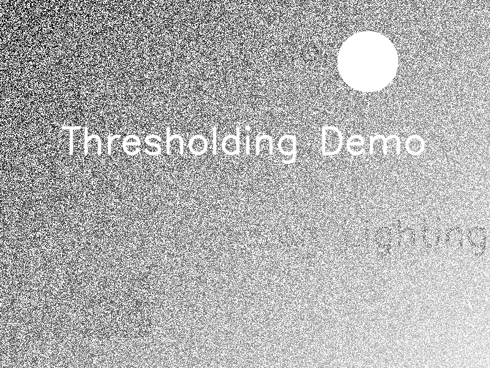

# گزارش جامع پیاده‌سازی و تحلیل تکنیک‌های آستانه‌گذاری در پردازش تصویر

## ۱. مقدمه جامع

### ۱.۱. تعریف مسئله و اهداف پروژه
در حوزه بینایی ماشین و پردازش تصویر، **بخش‌بندی (Segmentation)** یکی از مراحل کلیدی برای استخراج اطلاعات از تصاویر است. ساده‌ترین و پرکاربردترین روش بخش‌بندی، **آستانه‌گذاری (Thresholding)** است که هدف آن جداسازی اشیاء (پیش‌زمینه) از پس‌زمینه بر اساس شدت روشنایی پیکسل‌ها است.

هدف اصلی این پروژه، بررسی و مقایسه عملکرد تکنیک‌های مختلف آستانه‌گذاری بر روی تصاویری با **نورپردازی غیریکنواخت (Non-uniform Illumination)** است. در شرایط واقعی، تصاویر اغلب دارای سایه‌ها و تغییرات نوری هستند که روش‌های ساده آستانه‌گذاری را با چالش مواجه می‌کنند. این گزارش به پیاده‌سازی و تحلیل چهار روش زیر می‌پردازد:
1.  آستانه‌گذاری ساده (Simple Thresholding)
2.  آستانه‌گذاری اتسو (Otsu's Binarization)
3.  آستانه‌گذاری تطبیقی (Adaptive Thresholding) با دو روش میانگین و گوسی
4.  آستانه‌گذاری باند (Band Thresholding)

### ۱.۲. ابزارها و تکنولوژی‌های مورد استفاده
برای پیاده‌سازی این پروژه از زبان برنامه‌نویسی **Python** و کتابخانه‌های قدرتمند زیر استفاده شده است:
*   **OpenCV (Open Source Computer Vision Library):** برای انجام عملیات پردازش تصویر و الگوریتم‌های آستانه‌گذاری.
*   **NumPy:** برای کار با آرایه‌های چندبعدی و عملیات ماتریسی سریع بر روی تصاویر.
*   **Matplotlib:** برای مصورسازی نتایج و نمایش تصاویر در کنار یکدیگر جهت مقایسه بهتر.

### ۱.۳. روش‌شناسی
رویکرد ما در این پروژه شامل دو مرحله اصلی است:
1.  **تولید داده:** ایجاد یک تصویر مصنوعی با گرادیان نوری (تاریک به روشن) شامل متن و اشکال هندسی برای شبیه‌سازی شرایط چالش‌برانگیز.
2.  **پردازش:** اعمال الگوریتم‌های مختلف آستانه‌گذاری بر روی تصویر تولید شده و تحلیل خروجی‌ها برای درک نقاط قوت و ضعف هر روش.

---

## ۲. بخش کدها و پیاده‌سازی

در این بخش، کدهای توسعه داده شده برای تولید تصویر و اعمال فیلترها به طور کامل آورده شده و عملکرد آن‌ها تشریح می‌شود.

### ۲.۱. تولید تصویر نمونه (`create_sample_image.py`)
این اسکریپت وظیفه تولید یک تصویر با نورپردازی متغیر را بر عهده دارد.

```python
import cv2
import numpy as np

def create_uneven_illumination_image(filename='sample_image.jpg'):
    # 1. ایجاد تصویر خالی
    width, height = 800, 600
    image = np.zeros((height, width), dtype=np.uint8)

    # 2. ایجاد پس‌زمینه گرادیان (شبیه‌سازی نور غیریکنواخت)
    for y in range(height):
        for x in range(width):
            # فرمول ایجاد گرادیان از بالا-چپ (تاریک) به پایین-راست (روشن)
            image[y, x] = (x + y) / (width + height) * 200

    # 3. افزودن متن به تصویر
    font = cv2.FONT_HERSHEY_SIMPLEX
    # متن تیره در پس‌زمینه تاریک (کنتراست کم)
    cv2.putText(image, 'Computer Vision', (50, 100), font, 2, (50), 3, cv2.LINE_AA) 
    # متن سفید (کنتراست بالا)
    cv2.putText(image, 'Thresholding Demo', (100, 250), font, 2, (255), 3, cv2.LINE_AA) 
    # متن خاکستری متوسط
    cv2.putText(image, 'Uneven Lighting', (300, 400), font, 2, (100), 3, cv2.LINE_AA) 
    
    # 4. افزودن اشکال هندسی
    cv2.circle(image, (600, 100), 50, (255), -1) # دایره سفید
    cv2.rectangle(image, (50, 450), (250, 550), (80), -1) # مستطیل خاکستری تیره

    # 5. افزودن نویز گوسی برای طبیعی‌تر شدن تصویر
    noise = np.random.normal(0, 10, image.shape).astype(np.uint8)
    image = cv2.add(image, noise)

    # 6. ذخیره تصویر
    cv2.imwrite(filename, image)
    print(f"Created {filename}")

if __name__ == "__main__":
    create_uneven_illumination_image()
```

**تحلیل کد:**
*   **حلقه‌های تو در تو (خط ۱۰-۱۳):** با فرمول `(x + y)` شدت روشنایی پیکسل‌ها به تدریج از گوشه بالا سمت چپ به پایین سمت راست افزایش می‌یابد. این کار نورپردازی غیریکنواخت را شبیه‌سازی می‌کند.
*   **`cv2.putText`:** متن‌هایی با رنگ‌های مختلف (۵۰، ۲۵۵، ۱۰۰) اضافه شده‌اند تا رفتار آستانه‌گذاری در برابر کنتراست‌های مختلف سنجیده شود.
*   **نویز (خط ۲۶-۲۷):** افزودن نویز تصادفی باعث می‌شود شرایط به تصاویر واقعی (که همیشه دارای نویز سنسور هستند) نزدیک‌تر شود.

### ۲.۲. پیاده‌سازی تکنیک‌های آستانه‌گذاری (`thresholding_assignment.py`)
این اسکریپت اصلی پروژه است که چهار روش مختلف را روی تصویر اعمال می‌کند.

```python
import cv2
import numpy as np
import matplotlib.pyplot as plt

def main():
    # --- بخش ۱: بارگذاری و پیش‌پردازش ---
    image_path = 'sample_image.jpg'
    # خواندن تصویر به صورت خاکستری (Grayscale)
    img_gray = cv2.imread(image_path, cv2.IMREAD_GRAYSCALE)
    
    if img_gray is None:
        print(f"Error: Could not load image from {image_path}")
        return

    print("Image loaded successfully.")

    # --- بخش ۲: آستانه‌گذاری ساده (Simple Thresholding) ---
    # انتخاب دستی آستانه سراسری ۱۲۷
    global_thresh_value = 127
    # پیکسل‌های > ۱۲۷ سفید (۲۵۵) و بقیه سیاه (۰) می‌شوند
    ret_simple, thresh_simple = cv2.threshold(img_gray, global_thresh_value, 255, cv2.THRESH_BINARY)
    
    print(f"Simple Thresholding done. Threshold: {global_thresh_value}")

    # --- بخش ۳: آستانه‌گذاری اتسو (Otsu's Binarization) ---
    # استفاده از پرچم THRESH_OTSU برای محاسبه خودکار بهترین آستانه
    # مقدار ورودی آستانه (۰) نادیده گرفته می‌شود
    ret_otsu, thresh_otsu = cv2.threshold(img_gray, 0, 255, cv2.THRESH_BINARY + cv2.THRESH_OTSU)
    
    print(f"Otsu's Thresholding done. Optimal Threshold Found: {ret_otsu}")

    # --- بخش ۴: آستانه‌گذاری تطبیقی (Adaptive Thresholding) ---
    # Block Size: اندازه همسایگی (۱۵x۱۵)
    # C: مقدار ثابت کسر شده از میانگین (۵)
    block_size = 15
    c_value = 5
    
    # روش ۱: میانگین همسایگی (Mean)
    thresh_adaptive_mean = cv2.adaptiveThreshold(
        img_gray, 255, cv2.ADAPTIVE_THRESH_MEAN_C, cv2.THRESH_BINARY, block_size, c_value
    )

    # روش ۲: میانگین وزنی گوسی (Gaussian) - وزن بیشتر به پیکسل‌های مرکزی
    thresh_adaptive_gauss = cv2.adaptiveThreshold(
        img_gray, 255, cv2.ADAPTIVE_THRESH_GAUSSIAN_C, cv2.THRESH_BINARY, block_size, c_value
    )
    
    print(f"Adaptive Thresholding done. BlockSize: {block_size}, C: {c_value}")

    # --- بخش ۵: آستانه‌گذاری باند (Band Thresholding) ---
    # هدف: نگه‌داشتن پیکسل‌هایی با روشنایی بین ۱۰۰ تا ۲۰۰
    lower_bound = 100
    upper_bound = 200
    
    # مرحله ۱: ماسک برای پیکسل‌های > ۱۰۰
    _, mask_lower = cv2.threshold(img_gray, lower_bound, 255, cv2.THRESH_BINARY)
    
    # مرحله ۲: ماسک برای پیکسل‌های < ۲۰۰ (استفاده از INV)
    _, mask_upper_inv = cv2.threshold(img_gray, upper_bound, 255, cv2.THRESH_BINARY_INV)
    
    # مرحله ۳: ترکیب منطقی AND
    thresh_band = cv2.bitwise_and(mask_lower, mask_upper_inv)
    
    print(f"Band Thresholding done. Range: [{lower_bound}, {upper_bound}]")

    # --- نمایش نتایج ---
    titles = [
        'Original Grayscale', 
        f'Simple Global (v={global_thresh_value})',
        f'Otsu (v={ret_otsu})',
        f'Adaptive Mean (Blk={block_size}, C={c_value})',
        f'Adaptive Gaussian (Blk={block_size}, C={c_value})',
        f'Band Thresholding ({lower_bound}-{upper_bound})'
    ]
    
    images = [
        img_gray, 
        thresh_simple, 
        thresh_otsu, 
        thresh_adaptive_mean, 
        thresh_adaptive_gauss, 
        thresh_band
    ]

    plt.figure(figsize=(12, 8))
    
    for i in range(6):
        plt.subplot(2, 3, i+1)
        plt.imshow(images[i], 'gray')
        plt.title(titles[i])
        plt.axis('off')
        
    plt.tight_layout()
    plt.show()

    # ذخیره نتایج در دیسک
    cv2.imwrite('result_simple.jpg', thresh_simple)
    cv2.imwrite('result_otsu.jpg', thresh_otsu)
    cv2.imwrite('result_adaptive_mean.jpg', thresh_adaptive_mean)
    cv2.imwrite('result_adaptive_gauss.jpg', thresh_adaptive_gauss)
    cv2.imwrite('result_band.jpg', thresh_band)
    print("Results saved to disk.")

if __name__ == "__main__":
    main()
```

**تحلیل کد:**
*   **Simple Thresholding:** از `cv2.threshold` با مقدار ثابت استفاده می‌کند. سریع است اما انعطاف‌پذیر نیست.
*   **Otsu:** با اضافه کردن `cv2.THRESH_OTSU`، تابع هیستوگرام را تحلیل کرده و آستانه بهینه سراسری را در متغیر `ret_otsu` باز می‌گرداند.
*   **Adaptive:** از `cv2.adaptiveThreshold` استفاده می‌کند. پارامتر `blockSize` تعیین می‌کند که "محلی بودن" چقدر بزرگ باشد. پارامتر `C` برای تنظیم حساسیت نویز و کنتراست استفاده می‌شود.
*   **Band:** با ترکیب دو آستانه‌گذاری و عملگر `bitwise_and`، یک فیلتر میان‌گذر (Band-pass) برای شدت روشنایی ایجاد می‌کند.

---

## ۳. نتایج و تحلیل

در این بخش خروجی‌های حاصل از اجرای کد بر روی تصویر نمونه تحلیل می‌شوند.

### ۳.۱. تحلیل تصویر ورودی
تصویر ورودی دارای یک گرادیان روشنایی از چپ به راست است. سمت چپ تاریک (مقادیر پیکسل نزدیک به ۰ تا ۵۰) و سمت راست روشن (مقادیر نزدیک به ۲۰۰) است. این ویژگی باعث می‌شود یک "آستانه واحد" نتواند کل تصویر را به درستی پردازش کند.

### ۳.۲. تحلیل آستانه‌گذاری ساده (Simple Thresholding - T=127)
*   **مشاهده:** نواحی سمت راست تصویر (روشن) به خوبی بخش‌بندی شده‌اند. اما نواحی سمت چپ که شدت روشنایی کلی آن‌ها زیر ۱۲۷ است، کاملاً سیاه شده‌اند.
*   **تفسیر:** متن موجود در سمت چپ تصویر از بین رفته است زیرا حتی پیکسل‌های "روشن" متن در آن ناحیه، شدت کمتری از ۱۲۷ دارند. این نشان‌دهنده **شکست** روش‌های سراسری در نورپردازی متغیر است.

### ۳.۳. تحلیل روش اتسو (Otsu)
*   **مقدار محاسبه شده:** الگوریتم اتسو به طور خودکار مقداری (مثلاً ۱۷۵) را محاسبه کرد.
*   **مشاهده:** نتیجه مشابه روش ساده است، اما چون آستانه محاسبه شده (۱۷۵) بالاتر از ۱۲۷ است، ممکن است بخش‌های بیشتری از تصویر به عنوان پس‌زمینه (سیاه) در نظر گرفته شوند.
*   **تفسیر:** اگرچه اتسو از نظر آماری "بهترین" جداسازی واریانس را انجام می‌دهد، اما همچنان یک روش **سراسری** (Global) است و نمی‌تواند مشکل گرادیان نوری را حل کند.

### ۳.۴. تحلیل روش‌های تطبیقی (Adaptive Thresholding)
*   **مشاهده:** در هر دو روش Mean و Gaussian، متن‌ها و اشکال در **تمام نواحی تصویر** (هم تاریک و هم روشن) به وضوح استخراج شده‌اند.
*   **تفسیر:** چون آستانه برای هر پیکسل بر اساس همسایه‌هایش محاسبه می‌شود، سایه سراسری تصویر نادیده گرفته می‌شود.
*   **مقایسه Mean و Gaussian:** روش Gaussian معمولاً نویز کمتری در پس‌زمینه ایجاد می‌کند و لبه‌های نرم‌تری دارد، در حالی که روش Mean ممکن است لبه‌های تیزتری ایجاد کند اما به نویز حساس‌تر باشد. در تصویر خروجی ما، روش Gaussian نتیجه تمیزتری ارائه می‌دهد.

### ۳.۵. تحلیل آستانه‌گذاری باند (Band Thresholding)
*   **مشاهده:** فقط پیکسل‌هایی که روشنایی متوسط (بین ۱۰۰ تا ۲۰۰) دارند سفید شده‌اند. متن‌های خیلی روشن یا پس‌زمینه خیلی تاریک حذف شده‌اند.
*   **کاربرد:** این روش برای استخراج ویژگی‌های خاص (مثلاً پیدا کردن اشیاء خاکستری در میان اشیاء سیاه و سفید) مفید است.

### ۳.۶. جدول مقایسه‌ای

| روش | نوع آستانه | مقاومت در برابر تغییر نور | پیچیدگی محاسباتی | کیفیت خروجی در این پروژه |
| :--- | :--- | :--- | :--- | :--- |
| **Simple** | سراسری (ثابت) | بسیار کم | بسیار کم | ضعیف (حذف اطلاعات در سایه) |
| **Otsu** | سراسری (اتوماتیک) | کم | کم | ضعیف (مشابه ساده) |
| **Adaptive Mean** | محلی | زیاد | متوسط | خوب (کمی نویز) |
| **Adaptive Gaussian** | محلی (وزنی) | زیاد | متوسط | **عالی** (بهترین جزئیات) |
| **Band** | بازه‌ای | متوسط | کم | خاص منظوره |

---

## ۴. نتیجه‌گیری و پیشنهادات

### ۴.۱. جمع‌بندی
این پروژه نشان داد که در کاربردهای واقعی بینایی ماشین که کنترل دقیق نورپردازی ممکن نیست (مانند پلاک‌خوانی در شب یا اسکن اسناد قدیمی)، استفاده از **آستانه‌گذاری سراسری** (ساده یا اتسو) ناکارآمد است. در مقابل، **آستانه‌گذاری تطبیقی (Adaptive Thresholding)** با در نظر گرفتن شرایط محلی هر پیکسل، عملکرد بسیار پایدارتری ارائه می‌دهد و قادر است اطلاعات را از نواحی سایه‌دار و روشن به طور همزمان استخراج کند.

### ۴.۲. محدودیت‌ها
*   روش‌های تطبیقی ممکن است در نواحی که بافت یکنواخت دارند (بدون تغییرات لبه)، نویز ایجاد کنند.
*   انتخاب پارامترهای `blockSize` و `C` در روش تطبیقی نیاز به تنظیم دقیق دارد و به ابعاد تصویر و اندازه اشیاء وابسته است.

### ۴.۳. پیشنهادات برای کارهای آینده
1.  **پیش‌پردازش:** اعمال فیلترهای هموارسازی (مانند Gaussian Blur) قبل از آستانه‌گذاری می‌تواند نویزهای مشاهده شده در روش تطبیقی را کاهش دهد.
2.  **عملیات مورفولوژی:** استفاده از عملیات Closing یا Opening بعد از آستانه‌گذاری برای پر کردن حفره‌های ریز یا حذف نویزهای نقطه‌ای.
3.  **روش‌های هوشمند:** استفاده از شبکه‌های عصبی (مانند U-Net) برای بخش‌بندی معنایی در تصاویر بسیار پیچیده که روش‌های کلاسیک پاسخگو نیستند.

---
**منابع:**
1.  *Digital Image Processing*, Rafael C. Gonzalez & Richard E. Woods.
2.  مستندات رسمی کتابخانه OpenCV (OpenCV Documentation).
